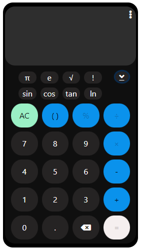
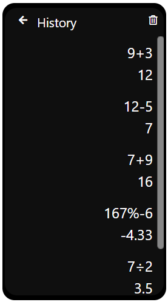

# Calculator

This is a multifunctional calculator.

https://y0uk1.github.io/Calculator/

# Demo

 

# Features

- You can use basic operaters (+, -, ×, ÷).
- You can use additional functions (√, !, sin, cos, tan, ln).
- You can use Pi and Napier's constant.
- You can check your calculaton history and use them in calculation.
